Before organising activities in support of open scholarship, we asked academics in Nijmegen about thier experience with open science practices - what they were already familiar with, what they would like to learn, and so on. Here is an overview of the most important findings.

## Participant demographics

### Career stage
We received responses from people in different stages of their academic career.
  (_n_ = 281)

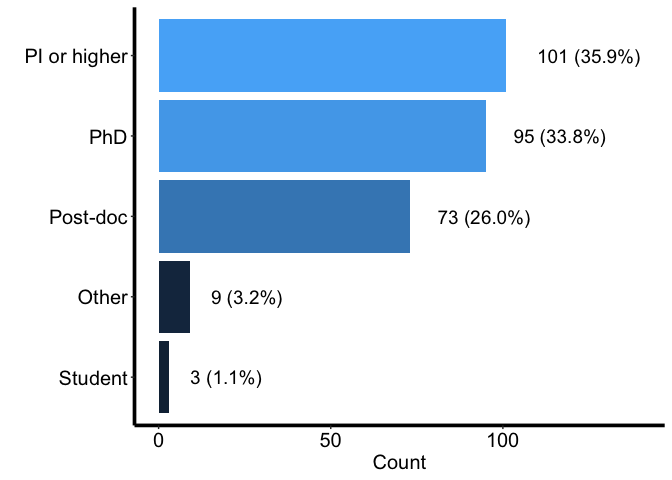

### Affiliation

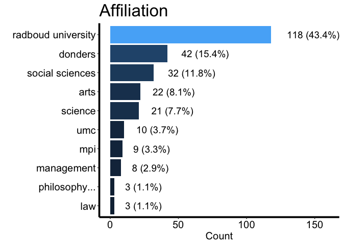

### Research field
We would have liked to hear from people from different research fields. But we will continue to gather information offline too.  

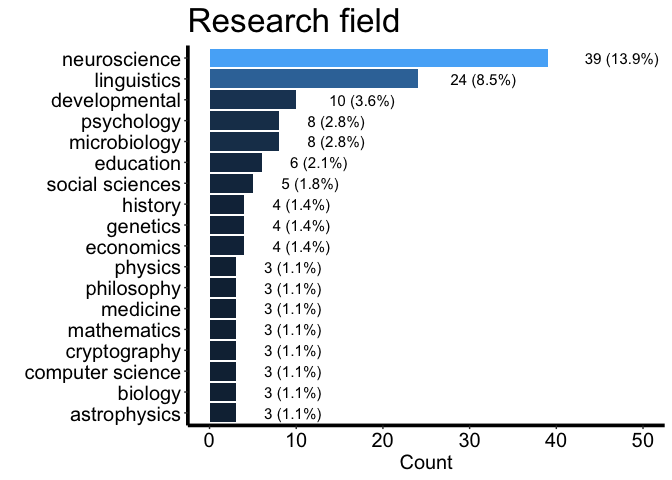

## Keywords

### What main keywords do you associate with "open science"?

## Components of Open Science

### Perceived importance of specific Open Science components.

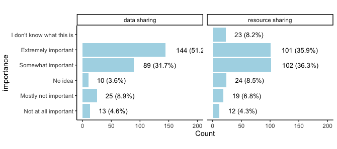
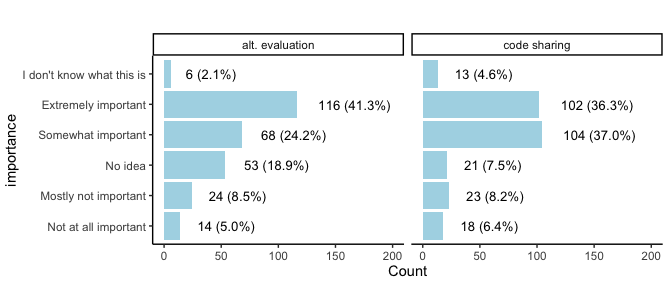
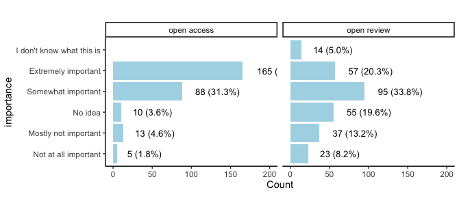
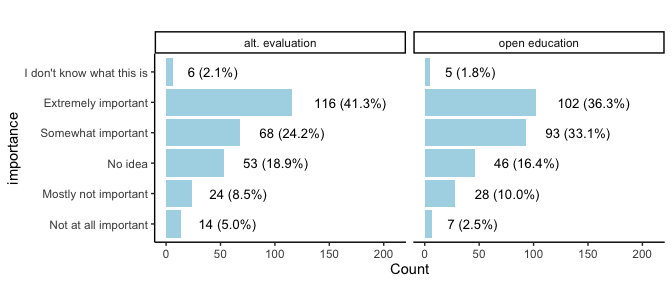

## Experience with OS

### Have you ever requested data?
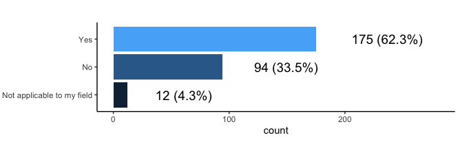

### Why did you request the data?

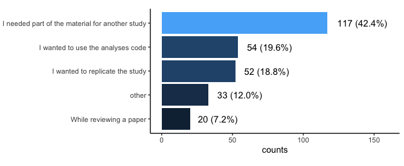

### Have you ever practiced any of the following open scholarship practices?  

- **data sharing**: made your data (or data tables) publicly available
- **materials sharing**: made your materials (experimental stimuli, scripts, etc.) publicly available
- **data reuse**: used or analysed publicly available data or materials from someone else
- **preregistration**: preregistered a study
- **direct replication**: directly replicated findings (i.e. ran the exact same study, of yours or that of someone else, again
- **open access publishing**: publish strictly open access (includes hybrid, green, gold...)
- **no**: none of the above

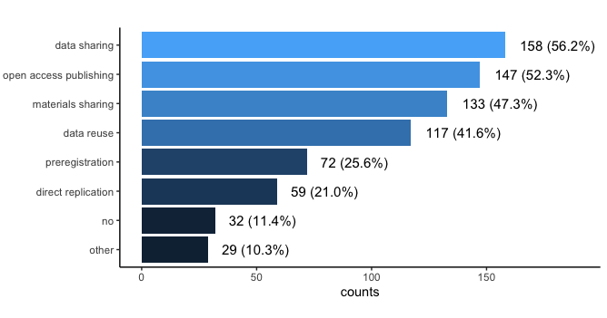

## Support
### How can we support you to do more open science?

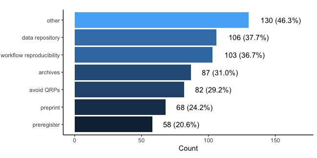

Here is a random selection of "other" responses:

- More funding
- Hire open science support staff
- Acknowledgement of results and not name of journals during job search etc
- Funding of data-storage needs to be arranged
- Provide support and specific instructions for open science practices in each stage of [a] project
- Make sure time is planned for open science work
- I have already possibilities to share code and datasets
- set up central infrastructure

## Format

### What is your preferred format of information exchange regarding open science practices?

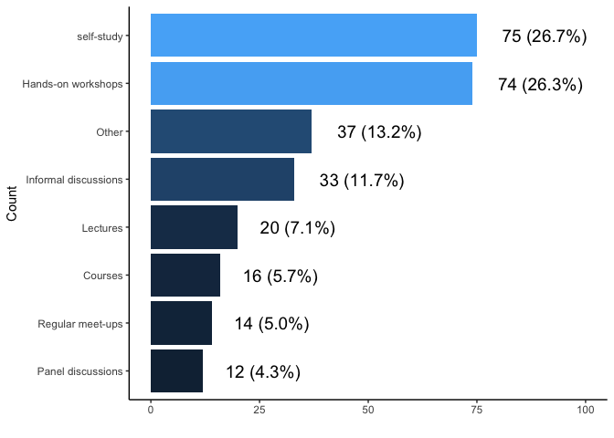

Here is a random selection of "other" responses:

- Manuals
- Short guest lectures. Any of these are probably effective.                                                   
- Helpdesk that is available when needed
- An online forum when info and good practices can be shared and people can ask questions
