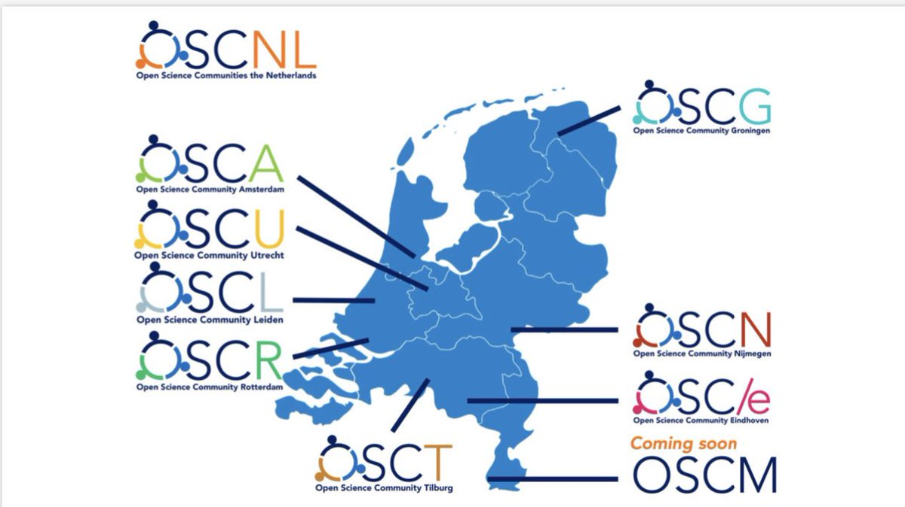

## Who are we?

Open Science Community Nijmegen (OSCN) is a community of scholars and other academic workers devoted to maintaining and developing scientific practices that ensure transparency, rigour, and reproducibilty of research and related academic work (the term 'science' is used in its broadest, inclusive sense to include humanities and social sciences, i.e. it more suitably refers to open scholarship).

Although the target audience are academic workers from Nijmegen, OSCN considers itself a part of a larger open science movement. On a national level, OSCN is one of eight [Open Science Communities in the Netherlands (OSC-NL)](https://openscience-nijmegen.nl/_pages/links/#local):

 

image credit: Anita Eerland

See [Links](https://radboud-university.github.io/osc-nijmegen/_pages/links/) for more information on national and international initiatives as well as educational resources to get you up to speed with everything open science!

## What is open science (open scholarship)?

There is no single definition of 'open science' that would cover the variety of principles and practices associated with it, however, the following definition from the [Open Science Training Handbook](https://open-science-training-handbook.gitbook.io/book/) provides a useful starting point:

> Open Science is the practice of science in such a way that others can collaborate and contribute, where research data, lab notes and other research processes are freely available, under terms that enable reuse, redistribution and reproduction of the research and its underlying data and methods.

Examples of 'open science practices' therefore include, among other, the practice of conducting preregistered studies (i.e. full transparency w.r.t. planned and conducted analyses), sharing research data and resources (e.g. computer code) required to reproduce empirical results, transparency in evaluation of scientific work (e.g. open peer review), ensuring free access to published work, etc. (for more, consult 'Educational resources' under [Links](https://radboud-university.github.io/osc-nijmegen/_pages/links/))

## Open science as a default

In OSCN, we do not distinguish 'open' science from 'traditional' science ('Open science is just science done right', the slogan goes) as many of the practices briefly outlined in the preceeding paragraph are best viewed as desirable _default_ scientific behaviours. The course of the technological and global sociopolitical developments in the recent decades (e.g. the rise of the world wide web) has considerably reshaped the way science can be and is conducted. Academic communities, however, have not yet fully cought up with the developments and possibilities offered to the extent that such disconnect can reasonably be thought to undermine the quality, credibility, and public image of scientific work.

## Why a local community?

The challenge remains how to implement the agreed upon principles and how to set up the desired default practices and to ensure active academic workers in local communities receive training to engage in these practices without a significant overhead that would impede their core research. This is where the [goals and activities](https://radboud-university.github.io/osc-nijmegen/_pages/goals/) of the OSCN come in.
