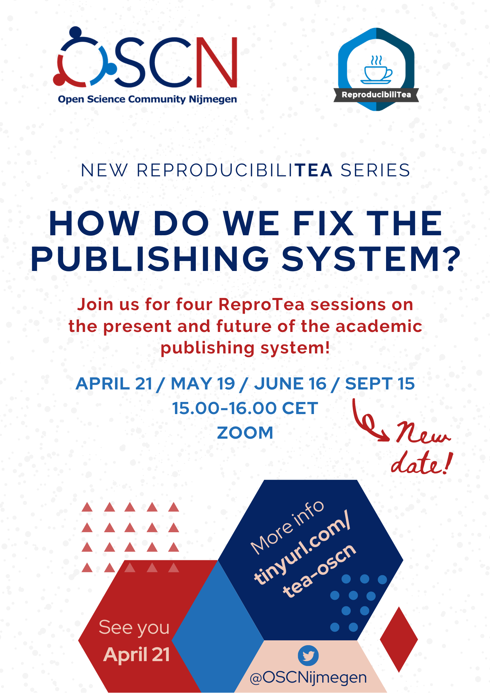

## Special series from April to September 2021: Fixing the publishing system series

For four sessions in April, May, June and September, we did ReproducibiliTea a little differently. We focussed on a particular aspect of the academic world, identified its problems and brainstormed solutions. The first topic we tackled was the publishing system. Ever been bothered by the fact that publishing Open Access feels a lot like being the victim of grand larceny? Or that it can take years to get through the review process, only for your paper to be rejected (yet again)? Ever heard of the 450 Movement? In the first session of this new series, we diagnosed exactly what’s wrong with the current publishing system and identified its problems. In the second and third session, we discussed both small, concrete and system-wide, radical solutions to those problems.

In the last meeting, we wrapped up and discussed any further points left open. We also collected more concrete examples of how these problems are already being addressed. Now that the series has finished, we plan to write a (short) report on the outcome of these four sessions, which we will make available on the OSCN website as a white paper and possibly also look to publish in a journal (if we still have confidence in the publishing system after we’re done!). Anyone who comes to one or more of the sessions will of course be acknowledged as a contributor to the report and paper. If you want to help us write the paper, leave your name in [this](https://docs.google.com/document/d/1OZ4CLoQ0YRNYQnblUv1zbOOIy1oBpyFx5liH9AejrMc/edit?usp=sharing) document.

More information on the white paper will be posted here in due time.

