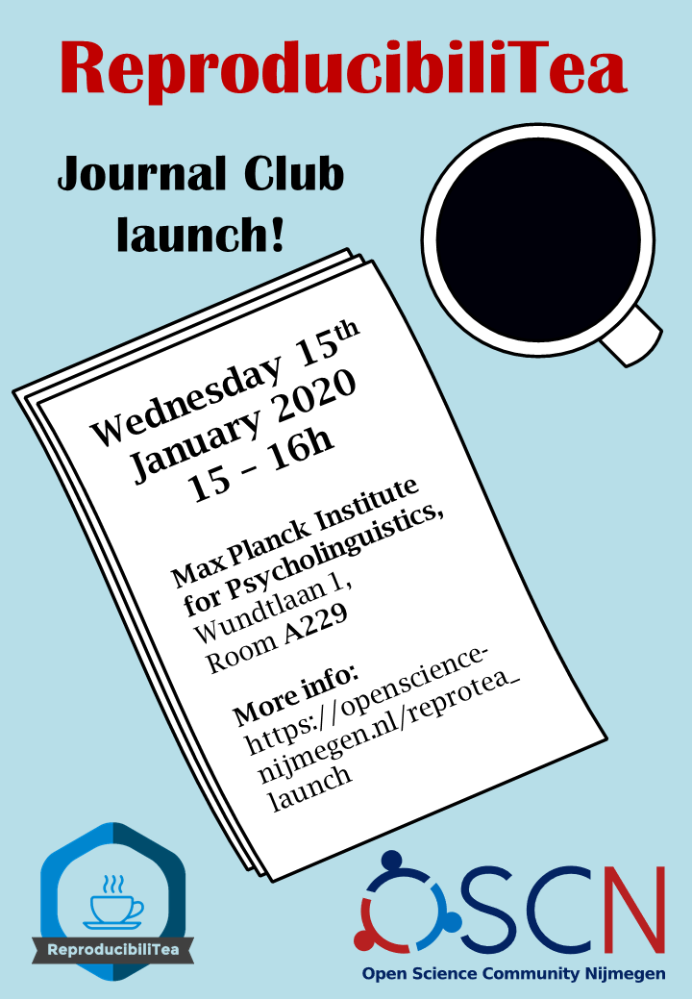

**When**: 15 January 2020 from 15:00 to 16:00

**Where**: Room A229 at the Max Planck Institute for Psycholinguistics (Wundtlaan 1, 6525 XD Nijmegen)

**What**: The very first meeting of ReproducibiliTea Nijmegen! [ReproducibiliTea](https://reproducibilitea.org/) is a grassroots journal club initiative. As suggested by the name, the discussions in these journal clubs revolves around matters of open science and reproducibility.

As this is our first meeting, we'll start with the basics! After some introdictions (who we are, what this initiative is), Johannes will briefly present our first paper: "False positive psychology: Undisclosed flexibililty in data collection and analysis allows presenting anything as significant" by Simmons, Nelson, and Simonsohn (2011). You can read the paper [here](https://journals.sagepub.com/doi/10.1177/0956797611417632). It's an article that's been hugely influential in discussion of open sciece in the last (almost) decade and is also quite short :wink:

If time allows, we'll also go over the schedule for future meetings and see what papers would be interesting to discuss. Eirini and Johannes have already thought of some articles but we want these discussions to reflect the interests of the attendees - you!

