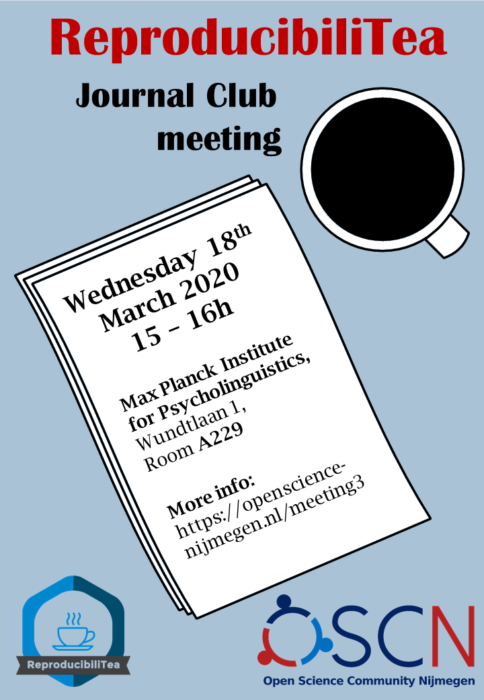

**When**: 15 April from 15:00 to 16:00

**Where**: Online! Register [here](https://forms.gle/pBzFWpred2fVFsqRA) to get the link and password.

**What**: The third meeting of ReproducibiliTea Nijmegen!
[ReproducibiliTea](https://reproducibilitea.org/) is a grassroots journal club initiative.
As suggested by the name, the discussions in these journal clubs revolves around matters of open science and reproducibility.

In this meeting, we'll be discussing "Rewarding resaerch transparency" by Morton Ann Gernsbacher (2018).
You can read the paper [here](https://doi.org/10.1016/j.tics.2018.07.002) or [here](https://www.ncbi.nlm.nih.gov/pmc/articles/PMC6195839/) (OA version).
In this meeting we'll discuss ways to reward research transparency.

This is the last meeting with papers planned, so we'll have to decide what to talk about next!
You can take a look at the papers suggestions [here](https://docs.google.com/spreadsheets/d/1efHsgzEu9OqKNRk9EARDNL3gBfsPNRgbdt7-PhfWS-U/edit#gid=0) and we'll vote on what to discuss at our next meeting :star:

