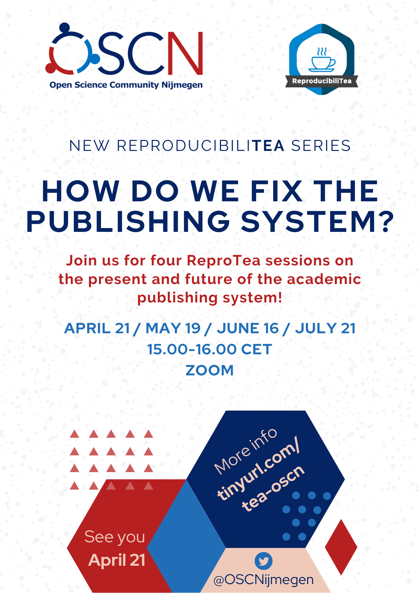

**When**: Wednesday, September 15th from 15:00 to 16:00

**Where**: Online! Register [here](https://forms.gle/EJkPkCx7jTNkfg8o8) to get the link and password.

**What**: ReproducibiliTea Nijmegen is part of [ReproducibiliTea](https://reproducibilitea.org/), a grassroots journal club initiative.
As suggested by the name, the discussions in these journal clubs revolves around matters of open science and reproducibility.

From April onwards, we’re going to do ReproducibiliTea a little differently. For three to four sessions, we will focus on a particular aspect of the academic world, identify its problems and brainstorm solutions. The first topic we will tackle is the publishing system. Ever been bothered by the fact that publishing Open Access feels a lot like being the victim of grand larceny? Or that it can take years to get through the review process, only for your paper to be rejected (yet again)? Ever heard of the [450 Movement](https://twitter.com/450Movement)? In the first session of this new series, we will diagnose exactly what’s wrong with the current publishing system and identify its problems. In the second (and possibly third) session, we will discuss concrete solutions to those problems. In the final session, we will sum up the discussion and fine-tune our solutions. At the end of the series, we also plan to write a (short) report on the outcome of these three to four sessions, which we will make available on the OSCN website as a white paper and possibly also look to publish in a journal (if we still have confidence in the publishing system after we’re done!). Anyone who comes to one or more of the sessions will of course be acknowledged as a contributor to the report and paper.

In our first meeting on April 21, we collected problems with the academic publishing system. In the meetings on May 19 and June 16, we tried to come up with constructive solutions for them. In the meeting on September 15, we will wrap up and discuss further open points. We will also collect more concrete examples of how these problems are already being addressed. If you have missed an earlier meeting, it is definitely still possible to join the series; just sign-up via the link above! 

